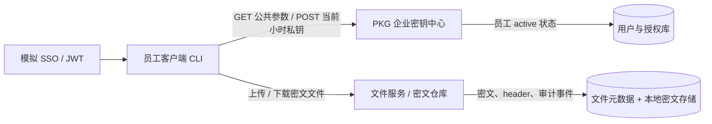
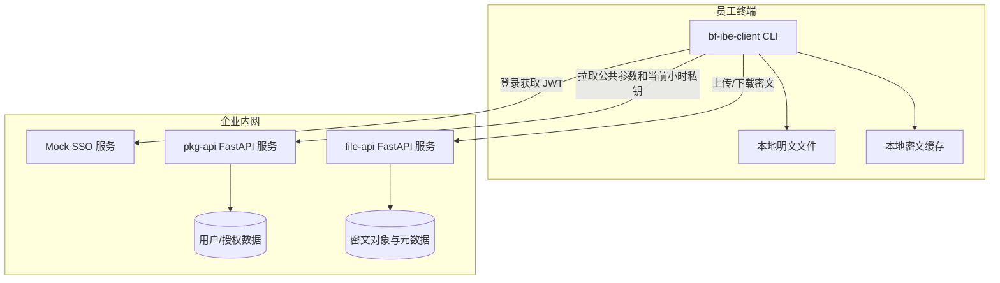
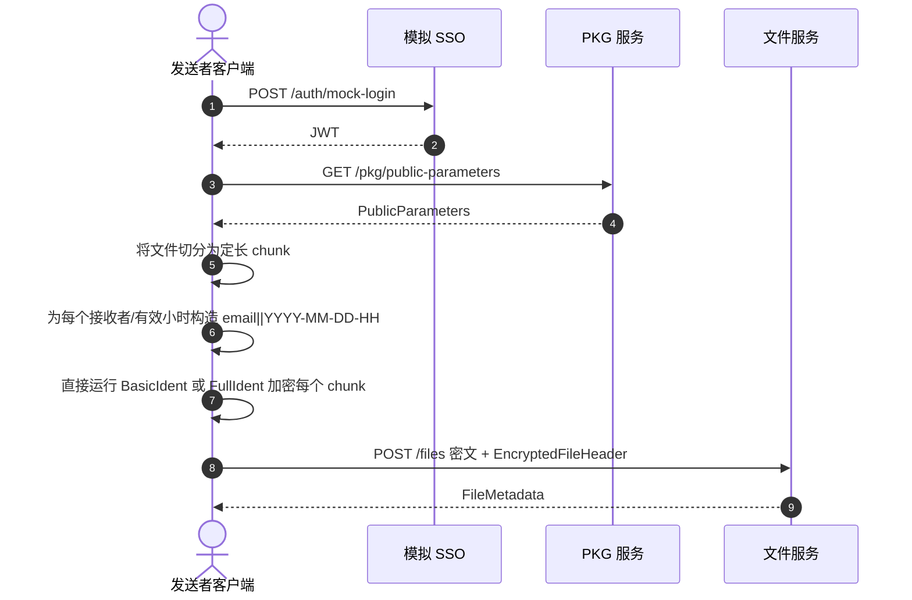
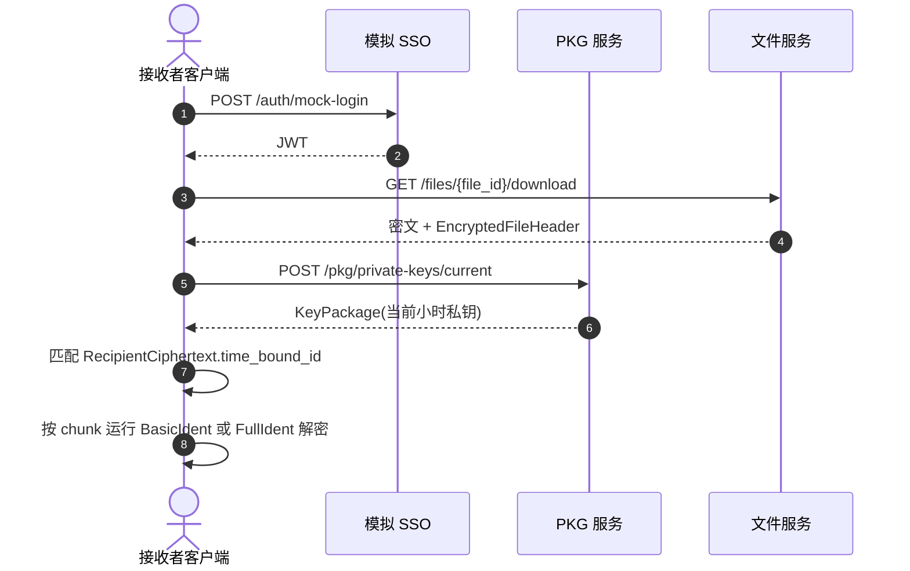
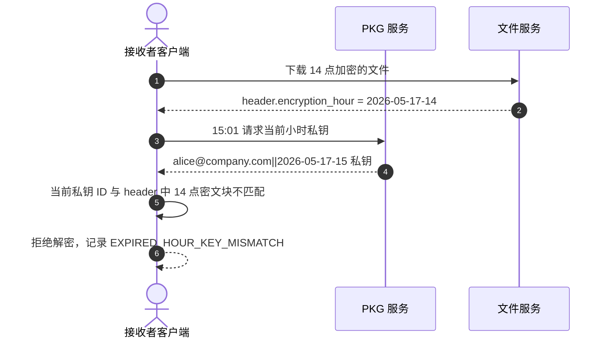
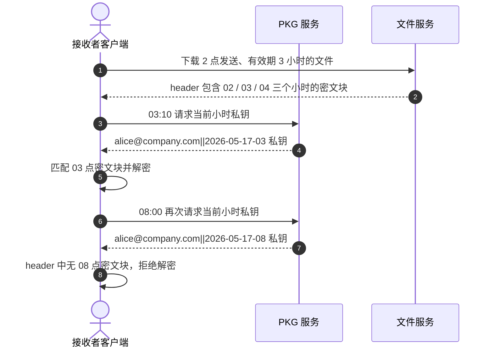
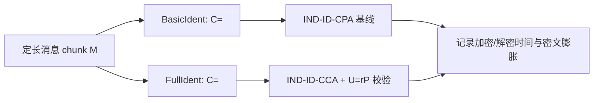

# 阶段一 Mermaid 图

## 组件图

```mermaid
flowchart LR
  SSO["模拟 SSO / JWT"] --> C["员工客户端 CLI"]
  C -->|"GET 公共参数 / POST 当前小时私钥"| PKG["PKG 企业密钥中心"]
  C -->|"上传 / 下载密文文件"| FS["文件服务 / 密文仓库"]
  PKG -->|"员工 active 状态"| UDB[("用户与授权库")]
  FS -->|"密文、header、审计事件"| FDB[("文件元数据 + 本地密文存储")]
```

## 部署图

```mermaid
flowchart TB
  subgraph ClientHost["员工终端"]
    CLI["bf-ibe-client CLI"]
    Plain["本地明文文件"]
    CipherLocal["本地密文缓存"]
  end

  subgraph Intranet["企业内网"]
    Auth["Mock SSO 服务"]
    PKG["pkg-api FastAPI 服务"]
    FileAPI["file-api FastAPI 服务"]
    UserStore[("用户/授权数据")]
    FileStore[("密文对象与元数据")]
  end

  CLI --> Plain
  CLI --> CipherLocal
  CLI -->|"登录获取 JWT"| Auth
  CLI -->|"拉取公共参数和当前小时私钥"| PKG
  CLI -->|"上传/下载密文"| FileAPI
  PKG --> UserStore
  FileAPI --> FileStore
```

## 加密上传流程

```mermaid
sequenceDiagram
  autonumber
  actor Sender as 发送者客户端
  participant SSO as 模拟 SSO
  participant PKG as PKG 服务
  participant FS as 文件服务

  Sender->>SSO: POST /auth/mock-login
  SSO-->>Sender: JWT
  Sender->>PKG: GET /pkg/public-parameters
  PKG-->>Sender: PublicParameters
  Sender->>Sender: 将文件切分为定长 chunk
  Sender->>Sender: 为每个接收者/有效小时构造 email||YYYY-MM-DD-HH
  Sender->>Sender: 直接运行 BasicIdent 或 FullIdent 加密每个 chunk
  Sender->>FS: POST /files 密文 + EncryptedFileHeader
  FS-->>Sender: FileMetadata
```

## 解密下载流程

```mermaid
sequenceDiagram
  autonumber
  actor Receiver as 接收者客户端
  participant SSO as 模拟 SSO
  participant PKG as PKG 服务
  participant FS as 文件服务

  Receiver->>SSO: POST /auth/mock-login
  SSO-->>Receiver: JWT
  Receiver->>FS: GET /files/{file_id}/download
  FS-->>Receiver: 密文 + EncryptedFileHeader
  Receiver->>PKG: POST /pkg/private-keys/current
  PKG-->>Receiver: KeyPackage(当前小时私钥)
  Receiver->>Receiver: 匹配 RecipientCiphertext.time_bound_id
  Receiver->>Receiver: 按 chunk 运行 BasicIdent 或 FullIdent 解密
```

## 小时过期失败流程

```mermaid
sequenceDiagram
  autonumber
  actor Client as 接收者客户端
  participant PKG as PKG 服务
  participant FS as 文件服务

  Client->>FS: 下载 14 点加密的文件
  FS-->>Client: header.encryption_hour = 2026-05-17-14
  Client->>PKG: 15:01 请求当前小时私钥
  PKG-->>Client: alice@company.com||2026-05-17-15 私钥
  Client->>Client: 当前私钥 ID 与 header 中 14 点密文块不匹配
  Client-->>Client: 拒绝解密，记录 EXPIRED_HOUR_KEY_MISMATCH
```

## 有效期窗口访问流程

```mermaid
sequenceDiagram
  autonumber
  actor Client as 接收者客户端
  participant PKG as PKG 服务
  participant FS as 文件服务

  Client->>FS: 下载 2 点发送、有效期 3 小时的文件
  FS-->>Client: header 包含 02 / 03 / 04 三个小时的密文块
  Client->>PKG: 03:10 请求当前小时私钥
  PKG-->>Client: alice@company.com||2026-05-17-03 私钥
  Client->>Client: 匹配 03 点密文块并解密
  Client->>PKG: 08:00 再次请求当前小时私钥
  PKG-->>Client: alice@company.com||2026-05-17-08 私钥
  Client->>Client: header 中无 08 点密文块，拒绝解密
```

## BasicIdent 与 FullIdent 对比流程

```mermaid
flowchart LR
  Plain["定长消息 chunk M"] --> Basic["BasicIdent: C=<U,V>"]
  Plain --> Full["FullIdent: C=<U,V,W>"]
  Basic --> CPA["IND-ID-CPA 基线"]
  Full --> CCA["IND-ID-CCA + U=rP 校验"]
  CPA --> Bench["记录加密/解密时间与密文膨胀"]
  CCA --> Bench
```
