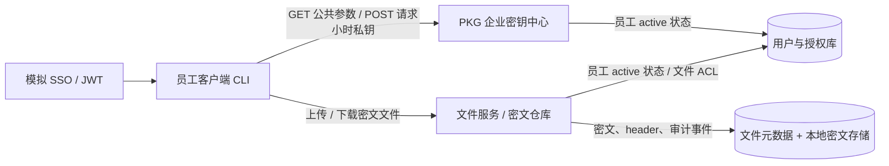
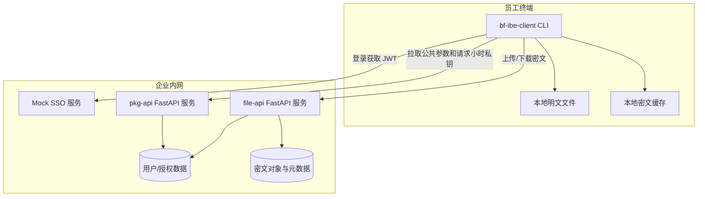
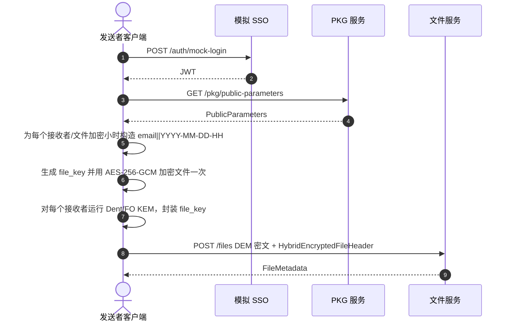
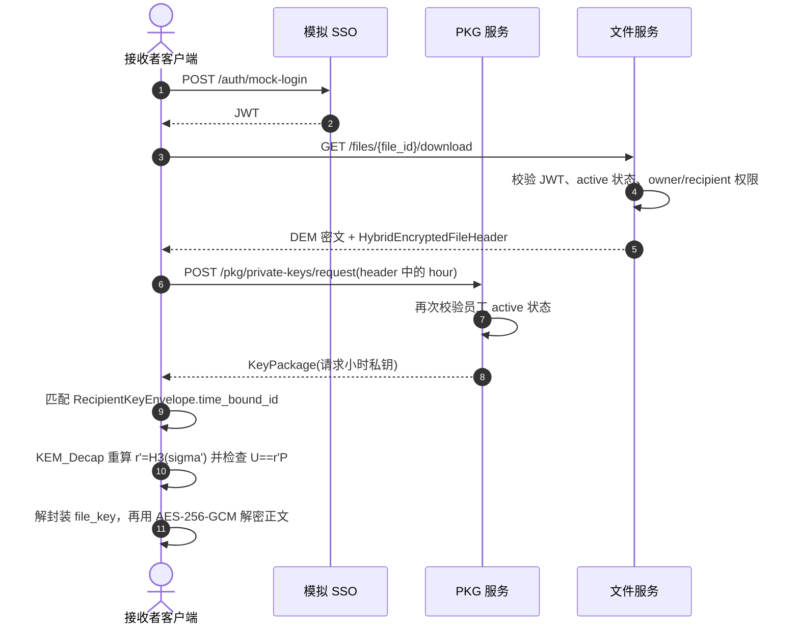
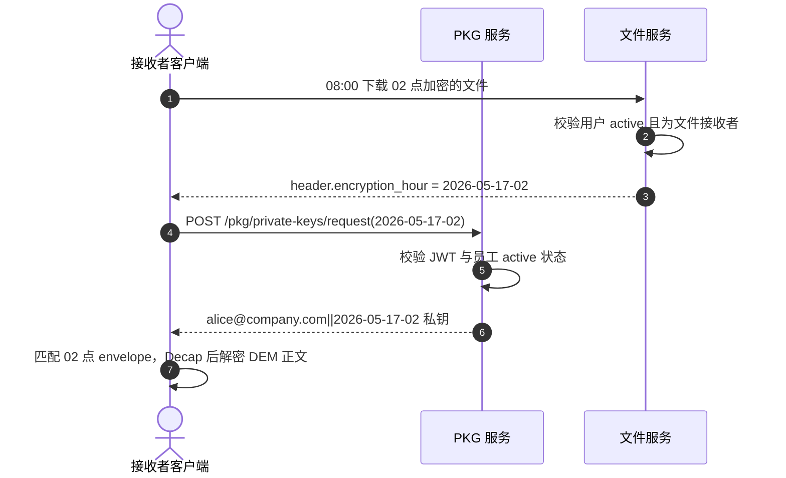
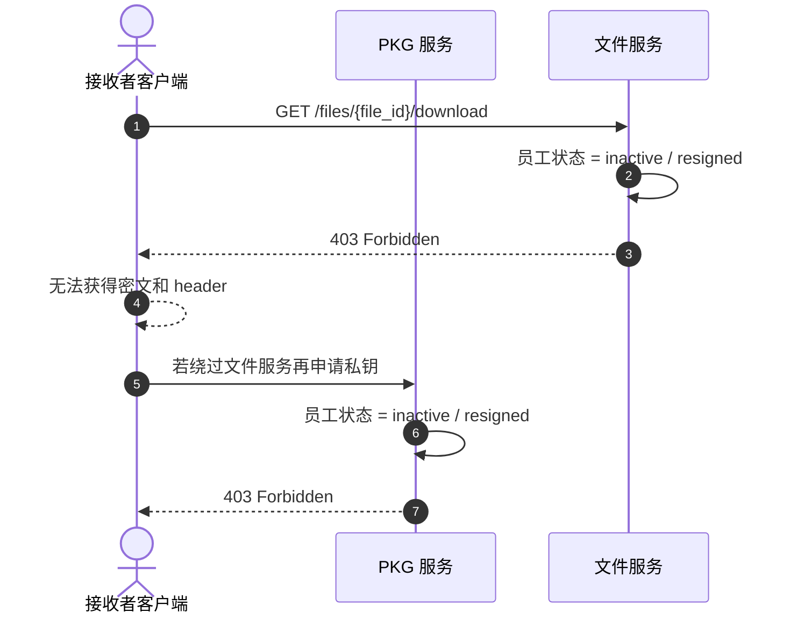
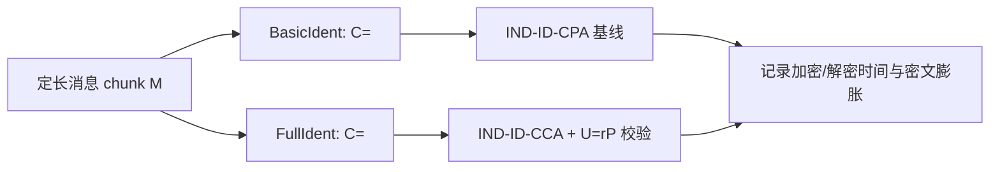
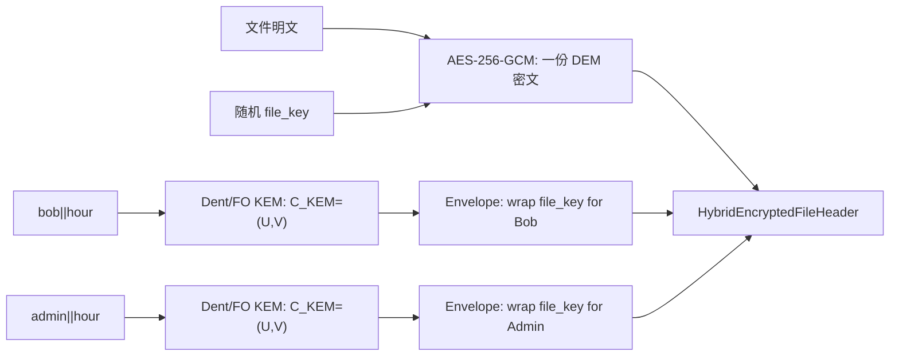

# Mermaid 图

## 组件图

```mermaid
flowchart LR
  SSO["模拟 SSO / JWT"] --> C["员工客户端 CLI"]
  C -->|"GET 公共参数 / POST 请求小时私钥"| PKG["PKG 企业密钥中心"]
  C -->|"上传 / 下载密文文件"| FS["文件服务 / 密文仓库"]
  PKG -->|"员工 active 状态"| UDB[("用户与授权库")]
  FS -->|"员工 active 状态 / 文件 ACL"| UDB
  FS -->|"密文、header、审计事件"| FDB[("文件元数据 + 本地密文存储")]
```

## 部署图

```mermaid
flowchart TB
  subgraph ClientHost["员工终端"]
    CLI["bf-ibe-client CLI"]
    Plain["本地明文文件"]
    CipherLocal["本地密文缓存"]
  end

  subgraph Intranet["企业内网"]
    Auth["Mock SSO 服务"]
    PKG["pkg-api FastAPI 服务"]
    FileAPI["file-api FastAPI 服务"]
    UserStore[("用户/授权数据")]
    FileStore[("密文对象与元数据")]
  end

  CLI --> Plain
  CLI --> CipherLocal
  CLI -->|"登录获取 JWT"| Auth
  CLI -->|"拉取公共参数和请求小时私钥"| PKG
  CLI -->|"上传/下载密文"| FileAPI
  PKG --> UserStore
  FileAPI --> UserStore
  FileAPI --> FileStore
```

## 加密上传流程

```mermaid
sequenceDiagram
  autonumber
  actor Sender as 发送者客户端
  participant SSO as 模拟 SSO
  participant PKG as PKG 服务
  participant FS as 文件服务

  Sender->>SSO: POST /auth/mock-login
  SSO-->>Sender: JWT
  Sender->>PKG: GET /pkg/public-parameters
  PKG-->>Sender: PublicParameters
  Sender->>Sender: 为每个接收者/文件加密小时构造 email||YYYY-MM-DD-HH
  Sender->>Sender: 生成 file_key 并用 AES-256-GCM 加密文件一次
  Sender->>Sender: 对每个接收者运行 Dent/FO KEM，封装 file_key
  Sender->>FS: POST /files DEM 密文 + HybridEncryptedFileHeader
  FS-->>Sender: FileMetadata
```

## 解密下载流程

```mermaid
sequenceDiagram
  autonumber
  actor Receiver as 接收者客户端
  participant SSO as 模拟 SSO
  participant PKG as PKG 服务
  participant FS as 文件服务

  Receiver->>SSO: POST /auth/mock-login
  SSO-->>Receiver: JWT
  Receiver->>FS: GET /files/{file_id}/download
  FS->>FS: 校验 JWT、active 状态、owner/recipient 权限
  FS-->>Receiver: DEM 密文 + HybridEncryptedFileHeader
  Receiver->>PKG: POST /pkg/private-keys/request(header 中的 hour)
  PKG->>PKG: 再次校验员工 active 状态
  PKG-->>Receiver: KeyPackage(请求小时私钥)
  Receiver->>Receiver: 匹配 RecipientKeyEnvelope.time_bound_id
  Receiver->>Receiver: KEM_Decap 重算 r'=H3(sigma') 并检查 U==r'P
  Receiver->>Receiver: 解封装 file_key，再用 AES-256-GCM 解密正文
```

## 旧文件访问流程

```mermaid
sequenceDiagram
  autonumber
  actor Client as 接收者客户端
  participant PKG as PKG 服务
  participant FS as 文件服务

  Client->>FS: 08:00 下载 02 点加密的文件
  FS->>FS: 校验用户 active 且为文件接收者
  FS-->>Client: header.encryption_hour = 2026-05-17-02
  Client->>PKG: POST /pkg/private-keys/request(2026-05-17-02)
  PKG->>PKG: 校验 JWT 与员工 active 状态
  PKG-->>Client: alice@company.com||2026-05-17-02 私钥
  Client->>Client: 匹配 02 点 envelope，Decap 后解密 DEM 正文
```

## 离职用户拒绝流程

```mermaid
sequenceDiagram
  autonumber
  actor Client as 接收者客户端
  participant PKG as PKG 服务
  participant FS as 文件服务

  Client->>FS: GET /files/{file_id}/download
  FS->>FS: 员工状态 = inactive / resigned
  FS-->>Client: 403 Forbidden
  Client-->>Client: 无法获得密文和 header
  Client->>PKG: 若绕过文件服务再申请私钥
  PKG->>PKG: 员工状态 = inactive / resigned
  PKG-->>Client: 403 Forbidden
```

## BasicIdent 与 FullIdent 对比流程

```mermaid
flowchart LR
  Plain["定长消息 chunk M"] --> Basic["BasicIdent: C=<U,V>"]
  Plain --> Full["FullIdent: C=<U,V,W>"]
  Basic --> CPA["IND-ID-CPA 基线"]
  Full --> CCA["IND-ID-CCA + U=rP 校验"]
  CPA --> Bench["记录加密/解密时间与密文膨胀"]
  CCA --> Bench
```

## KEM/DEM 主业务流程

```mermaid
flowchart LR
  Plain["文件明文"] --> DEM["AES-256-GCM: 一份 DEM 密文"]
  FK["随机 file_key"] --> DEM
  ID1["bob||hour"] --> KEM1["Dent/FO KEM: C_KEM=(U,V)"]
  ID2["admin||hour"] --> KEM2["Dent/FO KEM: C_KEM=(U,V)"]
  KEM1 --> Wrap1["Envelope: wrap file_key for Bob"]
  KEM2 --> Wrap2["Envelope: wrap file_key for Admin"]
  DEM --> Header["HybridEncryptedFileHeader"]
  Wrap1 --> Header
  Wrap2 --> Header
```
